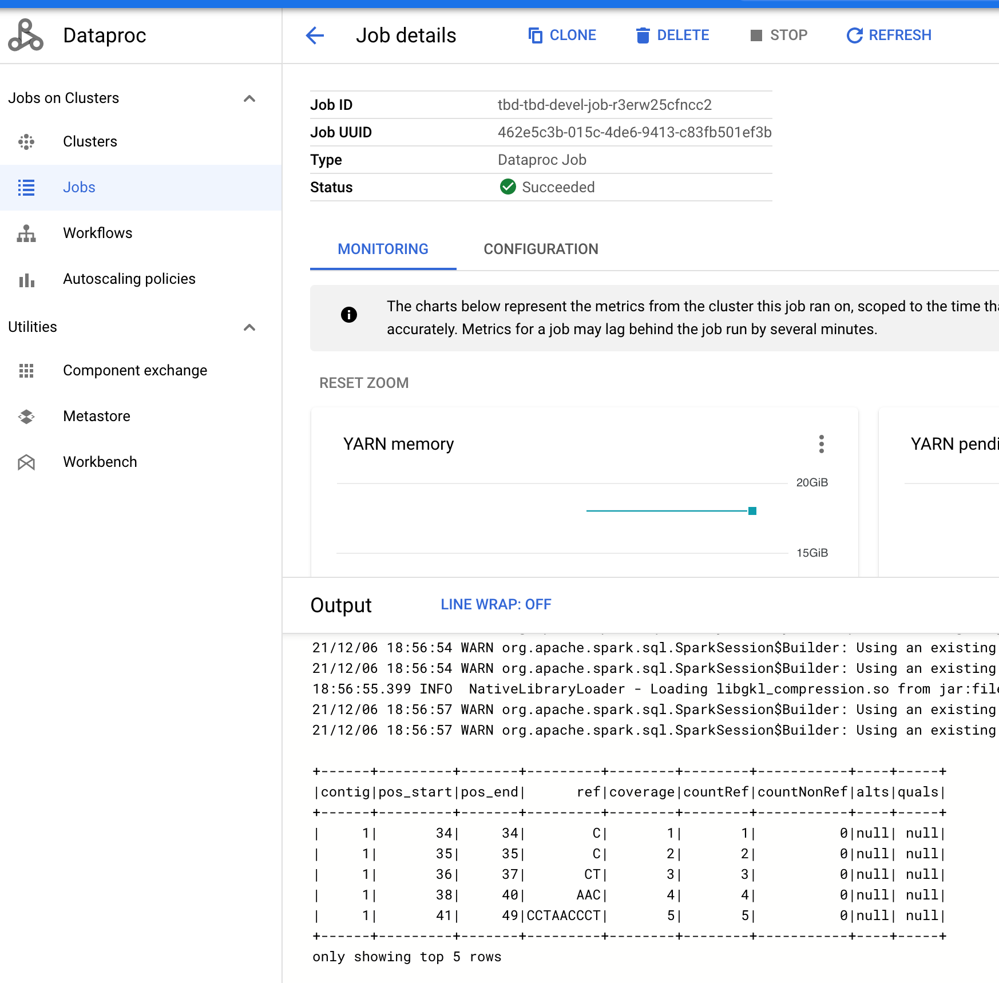

# sequila-recipes

[](https://search.maven.org/artifact/org.biodatageeks/sequila_2.12)
[](https://pypi.org/project/pysequila/)

SeQuiLa recipes, examples and other cloud-related content demonstrating
how to run SeQuila jobs in the cloud.
For most tasks we use [Terraform](https://www.terraform.io/downloads.html) as a main IaC (Infrastructure as Code) tool.

Table of Contents
=================

* [Disclaimer](#disclaimer)
* [Demo scenario](#demo-scenario)
* [Modules statuses](#modules-statuses)
    * [GCP](#gcp)
    * [Azure](#azure)
    * [AWS](#aws)
* [Init backends](#init)
* [Azure](#azure-1)
    * [Login](#login)
    * [AKS](#aks)
* [Databricks](#databricks)
    * [Login](#login-1)
* [GCP](#gcp-1)
    * [Login](#login-2)
    * [General GCP setup](#general-gcp-setup)
    * [Dataproc](#dataproc)
        * [Deploy](#deploy)
        * [Run](#run)
        * [Cleanup](#cleanup)
    * [GKE](#gke)
        * [Deploy](#deploy-1)
        * [Run](#run-1)
        * [Cleanup](#cleanup-1)
* [Development and contribution](#development-and-contribution)
    * [Setup pre-commit checks](#setup-pre-commit-checks)
* [Terraform doc](#terraform-doc)

    
# Disclaimer
These are NOT production-ready examples. Terraform modules and Docker images are scanned/linted with tools such
as [checkov](https://www.checkov.io/), [tflint](https://github.com/terraform-linters/tflint) and [tfsec](https://github.com/aquasecurity/tfsec)
but some security tweaks have been disabled for the sake of simplicity. Some cloud deployments best practices has been intentionally skipped
as well. Check code comments for details.

# Demo scenario
1. The presented scenario can be deployed on one of the main cloud providers: Azure(Microsoft), AWS(Amazon) and GCP(Google).
2. For each cloud two options are presented - deployment on managed Hadoop ecosystem (Azure - HDInsight, AWS - EMR, GCP - Dataproc) or
or using managed Kubernetes service (Azure - AKS, AWS - EKS and GCP - GKE).
3. Scenario includes the following steps:
   1. setup distributed object storage
   2. copy test data
   3. setup computing environment
   4. run a test PySeQuiLa job using PySpark using YARN or [spark-on-k8s-operator](https://github.com/GoogleCloudPlatform/spark-on-k8s-operator)
   5. We assume that:
   * on GCP: a project is created and attached to billing account
   * on Azure: a subscription is created (A Google Cloud project is conceptually similar to the Azure subscription, in terms of billing, quotas, and limits).
# Set SeQuiLa and PySeQuiLa versions
   
## Support matrix


| Cloud | Service   |Release        | Spark  | SeQuiLa |PySeQuila| Image tag*  |
|-------|-----------|---------------|--------|---------|---------|--------------|
| GCP   | GKE       |1.23.8-gke.1900              | 3.2.2  | 1.1.0   | 0.4.1   | docker.io/biodatageeks/spark-py:pysequila-0.3.4-gke-b3c836e|
| GCP   | Dataproc  |2.0.27-ubuntu18| 3.1.3  | 1.0.0   | 0.3.3   |   -|
| GCP   | Dataproc Serverless|1.0.21| 3.2.2  | 1.1.0   | 0.4.1   | gcr.io/${TF_VAR_project_name}/spark-py:pysequila-0.3.4-dataproc-b3c836e  |
| Azure | AKS       |???|3.2.2|1.1.0|0.4.1|

```bash
export TF_VAR_pysequila_version=0.4.1
export TF_VAR_sequila_version=1.1.0
export TF_VAR_pysequila_image_gke=docker.io/biodatageeks/spark-py:pysequila-${TF_VAR_pysequila_ver}-gke-c8debed
export TF_VAR_pysequila_image_dataproc=docker.io/biodatageeks/spark-py:pysequila-${TF_VAR_pysequila_ver}-dataproc-c8debed
```   
# Using SeQuiLa cli Docker image for GCP
```bash
export TF_VAR_project_name=tbd-tbd-devel
export TF_VAR_region=europe-west2
export TF_VAR_zone=europe-west2-b
docker run --rm -it \
    -e TF_VAR_project_name=${TF_VAR_project_name} \
    -e TF_VAR_region=${TF_VAR_region} \
    -e TF_VAR_zone=${TF_VAR_zone} \
    -e TF_VAR_pysequila_version=${TF_VAR_pysequila_version} \
    -e TF_VAR_sequila_version=${TF_VAR_sequila_version} \
    -e TF_VAR_pysequila_image_gke=${TF_VAR_pysequila_image_gke} \
biodatageeks/sequila-cloud-cli:7c1ebf6

cd git && git clone https://github.com/biodatageeks/sequila-cloud-recipes.git && \
cd sequila-cloud-recipes && \
cd cloud/gcp
terraform init
```


# Using SeQuiLa cli Docker image for Azure
```bash
docker run --rm -it biodatageeks/sequila-cloud-cli:a6c3eb0

cd git && git clone https://github.com/biodatageeks/sequila-cloud-recipes.git && \
cd sequila-cloud-recipes && \
cd cloud/azure
terraform init
```


# Modules statuses
## GCP

* [Dataproc](#Dataproc) :white_check_mark: 
* [Dataproc serverless](#Dataprocserverless) :white_check_mark:
* [GKE (Google Kubernetes Engine)](#GKE) :white_check_mark:

## Azure
* Databricks: :interrobang: (currently not supported)
* HDInsight: :soon:
* [AKS (Azure Kubernetes Service)](#AKS): :white_check_mark:

## AWS
* EMR: :soon:
* EKS(Elastic Kubernetes Service): :soon:

# Azure
## Login
Install [Azure CLI](https://docs.microsoft.com/en-us/cli/azure/install-azure-cli) and set default subscription
```bash
az login
az account set --subscription "Azure subscription 1"
```

## AKS
### Deploy

1. Ensure you are in the right subfolder
```bash
echo $PWD | rev | cut -f1,2 -d'/' | rev
cloud/azure
```
2. Run
```bash
terraform apply -var-file=../../env/azure.tfvars -var-file=../../env/azure-aks.tfvars -var-file=../../env/_all.tfvars
```
### Run
1. Connect to the K8S cluster, e.g.:
```bash
az aks get-credentials --resource-group sequila-resources --name sequila-aks1
# check connectivity
kubectl get nodes
NAME                              STATUS   ROLES   AGE   VERSION
aks-default-37875945-vmss000002   Ready    agent   59m   v1.20.9
aks-default-37875945-vmss000003   Ready    agent   59m   v1.20.9
```
2. Install [sparkctl](https://github.com/GoogleCloudPlatform/spark-on-k8s-operator/tree/master/sparkctl) (recommended) or use `kubectl`: \
   :bulb: Please replace references to staging bucket with your storageAccount, e.g.
```yaml
mainApplicationFile: wasb://sequila@sequilauxlw3g9fznm.blob.core.windows.net/jobs/pysequila/sequila-pileup-aks.py
```
and
```bash
sparkctl create ../../jobs/azure/aks/pysequila.yaml
```
After a while you will be able to check the logs:
```bash
sparkctl log -f pysequila
```


### Cleanup
```bash
sparkctl delete pysequila
terraform destroy -var-file=../../env/azure.tfvars -var-file=../../env/azure-aks.tfvars -var-file=../../env/_all.tfvars
```

## Databricks
## Login
1. Install [databricks-cli](https://docs.databricks.com/dev-tools/cli/index.html)
2. Generate PAT from [Databricks UI](https://docs.databricks.com/dev-tools/api/latest/authentication.html)
3. Configure cli 
```bash
databricks configure --token
```
4. Check if `~/.databrickscfg` file has been generated

# GCP
## Login
1. Install [Cloud SDK](https://cloud.google.com/sdk/docs/install)
2. Authenticate
```bash
gcloud auth application-default login
# set default project
gcloud config set project $TF_VAR_project_name
```

## General GCP setup
1. Set GCP project-related env variables, e.g.:
:bulb: If you use our image all the env variables are already set.

```bash
export TF_VAR_project_name=tbd-tbd-devel
export TF_VAR_region=europe-west2
export TF_VAR_zone=europe-west2-b
```
Above variables are necessary for both `Dataproc` and `GKE` setups.
2. Ensure you are in the right subfolder
```bash
echo $PWD | rev | cut -f1,2 -d'/' | rev
cloud/gcp
```
## Dataproc
### Deploy
```bash
terraform apply -var-file=../../env/gcp.tfvars -var-file=../../env/gcp-dataproc.tfvars -var-file=../../env/_all.tfvars
```
### Run
```bash
gcloud dataproc workflow-templates instantiate pysequila-workflow --region ${TF_VAR_region}

Waiting on operation [projects/tbd-tbd-devel/regions/europe-west2/operations/36cbc4dc-783c-336c-affd-147d24fa014c].
WorkflowTemplate [pysequila-workflow] RUNNING
Creating cluster: Operation ID [projects/tbd-tbd-devel/regions/europe-west2/operations/ef2869b4-d1eb-49d8-ba56-301c666d385b].
Created cluster: tbd-tbd-devel-cluster-s2ullo6gjaexa.
Job ID tbd-tbd-devel-job-s2ullo6gjaexa RUNNING
Job ID tbd-tbd-devel-job-s2ullo6gjaexa COMPLETED
Deleting cluster: Operation ID [projects/tbd-tbd-devel/regions/europe-west2/operations/0bff879e-1204-4971-ae9e-ccbf9c642847].
WorkflowTemplate [pysequila-workflow] DONE
Deleted cluster: tbd-tbd-devel-cluster-s2ullo6gjaexa.

```
or from GCP UI Console:




### Cleanup
```bash
terraform destroy -var-file=../../env/gcp.tfvars -var-file=../../env/gcp-dataproc.tfvars -var-file=../../env/_all.tfvars
```

## Dataprocserverless

### Deploy
1. Prepare infrastructure including a Container registry (see point 2)
```bash
terraform apply -var-file=../../env/gcp.tfvars -var-file=../../env/gcp-dataproc.tfvars -var-file=../../env/_all.tfvars
```
2. Since accoring to the [documentation](https://cloud.google.com/dataproc-serverless/docs/guides/custom-containers) Dataproc Serverless
services cannot fetch containers from other registries than GCP ones (in particular from `docker.io`). This is why you need to pull
a required image from `docker.io` and push it to your project GCR(Google Container Registry), e.g.:
```bash
gcloud auth configure-docker
docker tag  biodatageeks/spark-py:pysequila-0.4.1-dataproc-b3c836e  $TF_VAR_pysequila_image_dataproc
docker push $TF_VAR_pysequila_image_dataproc
```
### Run
```bash

gcloud dataproc batches submit pyspark gs://${TF_VAR_project_name}-staging/jobs/pysequila/sequila-pileup.py \
  --batch=pysequila \
  --region=${TF_VAR_region} \
  --container-image=${TF_VAR_pysequila_image_dataproc} \
  --version=1.0.21 \
  --files gs://bigdata-datascience-staging/data/Homo_sapiens_assembly18_chr1_chrM.small.fasta,gs://bigdata-datascience-staging/data/Homo_sapiens_assembly18_chr1_chrM.small.fasta.fai

Batch [pysequila] submitted.
Pulling image gcr.io/bigdata-datascience/spark-py:pysequila-0.3.4-dataproc-b3c836e
Image is up to date for sha256:30b836594e0a768211ab209ad02ad3ad0fb1c40c0578b3503f08c4fadbab7c81
Waiting for container log creation
PYSPARK_PYTHON=/usr/bin/python3.9
JAVA_HOME=/usr/lib/jvm/temurin-11-jdk-amd64
SPARK_EXTRA_CLASSPATH=/opt/spark/.ivy2/jars/*
SLF4J: Class path contains multiple SLF4J bindings.
SLF4J: Found binding in [jar:file:/usr/lib/spark/jars/slf4j-reload4j-1.7.36.jar!/org/slf4j/impl/StaticLoggerBinder.class]
SLF4J: Found binding in [jar:file:/opt/spark/.ivy2/jars/org.slf4j_slf4j-log4j12-1.7.25.jar!/org/slf4j/impl/StaticLoggerBinder.class]
SLF4J: See http://www.slf4j.org/codes.html#multiple_bindings for an explanation.
SLF4J: Actual binding is of type [org.slf4j.impl.Reload4jLoggerFactory]
:: loading settings :: file = /etc/spark/conf/ivysettings.xml
+------+---------+-------+---------+--------+--------+-----------+----+-----+
|contig|pos_start|pos_end|      ref|coverage|countRef|countNonRef|alts|quals|
+------+---------+-------+---------+--------+--------+-----------+----+-----+
|     1|       34|     34|        C|       1|       1|          0|null| null|
|     1|       35|     35|        C|       2|       2|          0|null| null|
|     1|       36|     37|       CT|       3|       3|          0|null| null|
|     1|       38|     40|      AAC|       4|       4|          0|null| null|
|     1|       41|     49|CCTAACCCT|       5|       5|          0|null| null|
+------+---------+-------+---------+--------+--------+-----------+----+-----+
only showing top 5 rows

Batch [pysequila] finished.
metadata:
  '@type': type.googleapis.com/google.cloud.dataproc.v1.BatchOperationMetadata
  batch: projects/bigdata-datascience/locations/europe-west2/batches/pysequila
  batchUuid: c798a09f-c690-4bc8-9dc8-6be5d1e565e0
  createTime: '2022-11-04T08:37:17.627022Z'
  description: Batch
  operationType: BATCH
name: projects/bigdata-datascience/regions/europe-west2/operations/a746a63b-61ed-3cca-816b-9f2a4ccae2f8

```


### Cleanup
1. Remove Dataproc serverless batch
```bash
 gcloud dataproc batches delete pysequila --region=${TF_VAR_region}
```
2. Destroy infrastructure

```bash
terraform apply -var-file=../../env/gcp.tfvars -var-file=../../env/gcp-dataproc.tfvars -var-file=../../env/_all.tfvars
```

## GKE
### Deploy
```bash
terraform apply -var-file=../../env/gcp.tfvars -var-file=../../env/gcp-gke.tfvars -var-file=../../env/_all.tfvars
```

### Run
1. Connect to the K8S cluster, e.g.:
```bash
gcloud container clusters get-credentials ${TF_VAR_project_name}-cluster --zone ${TF_VAR_zone} --project ${TF_VAR_project_name}
# check connectivity
kubectl get nodes
NAME                                                  STATUS   ROLES    AGE   VERSION
gke-tbd-tbd-devel-cl-tbd-tbd-devel-la-cb515767-8wqh   Ready    <none>   25m   v1.21.5-gke.1302
gke-tbd-tbd-devel-cl-tbd-tbd-devel-la-cb515767-dlr1   Ready    <none>   25m   v1.21.5-gke.1302
gke-tbd-tbd-devel-cl-tbd-tbd-devel-la-cb515767-r5l3   Ready    <none>   25m   v1.21.5-gke.1302
```
2. Install [sparkctl](https://github.com/GoogleCloudPlatform/spark-on-k8s-operator/tree/master/sparkctl) (recommended) or use `kubectl`: \
:bulb: If you use our image all the tools are already installed.

```bash
sparkctl create ../../jobs/gcp/gke/pysequila.yaml
```
After a while you will be able to check the logs:
```bash
sparkctl log -f pysequila
```


### Cleanup
```bash
sparkctl delete pysequila
terraform destroy -var-file=../../env/gcp.tfvars -var-file=../../env/gcp-gke.tfvars -var-file=../../env/_all.tfvars
```

# Development and contribution
## Setup pre-commit checks
1. Activate pre-commit integration
```bash
pre-commit install
```
2. Install pre-commit hooks  [deps](https://github.com/antonbabenko/pre-commit-terraform#1-install-dependencies)


# Terraform doc
## Requirements

| Name | Version |
|------|---------|
| <a name="requirement_azurerm"></a> [azurerm](#requirement\_azurerm) | ~> 2.33 |
| <a name="requirement_databricks"></a> [databricks](#requirement\_databricks) | 0.3.11 |
| <a name="requirement_google"></a> [google](#requirement\_google) | 4.2.0 |
| <a name="requirement_random"></a> [random](#requirement\_random) | ~> 2.2 |

## Providers

| Name | Version |
|------|---------|
| <a name="provider_google"></a> [google](#provider\_google) | 4.2.0 |

## Modules

| Name | Source | Version |
|------|--------|---------|
| <a name="module_aks"></a> [aks](#module\_aks) | ./modules/azure/aks | n/a |
| <a name="module_azure-resources"></a> [azure-resources](#module\_azure-resources) | ./modules/azure/resource-mgmt | n/a |
| <a name="module_azure-staging-blob"></a> [azure-staging-blob](#module\_azure-staging-blob) | ./modules/azure/staging-blob | n/a |
| <a name="module_data-aks"></a> [data-aks](#module\_data-aks) | ./modules/kubernetes/shared-storage | n/a |
| <a name="module_data-gke"></a> [data-gke](#module\_data-gke) | ./modules/kubernetes/shared-storage | n/a |
| <a name="module_gcp-dataproc-sequila-job"></a> [gcp-dataproc-sequila-job](#module\_gcp-dataproc-sequila-job) | ./modules/gcp/dataproc-workflow-template | n/a |
| <a name="module_gcp-staging-bucket"></a> [gcp-staging-bucket](#module\_gcp-staging-bucket) | ./modules/gcp/staging-bucket | n/a |
| <a name="module_gke"></a> [gke](#module\_gke) | ./modules/gcp/gke | n/a |
| <a name="module_persistent_volume-aks"></a> [persistent\_volume-aks](#module\_persistent\_volume-aks) | ./modules/kubernetes/pvc | n/a |
| <a name="module_persistent_volume-gke"></a> [persistent\_volume-gke](#module\_persistent\_volume-gke) | ./modules/kubernetes/pvc | n/a |
| <a name="module_spark-on-k8s-operator-aks"></a> [spark-on-k8s-operator-aks](#module\_spark-on-k8s-operator-aks) | ./modules/kubernetes/spark-on-k8s-operator | n/a |
| <a name="module_spark-on-k8s-operator-gke"></a> [spark-on-k8s-operator-gke](#module\_spark-on-k8s-operator-gke) | ./modules/kubernetes/spark-on-k8s-operator | n/a |

## Resources

| Name | Type |
|------|------|
| [google_client_config.default](https://registry.terraform.io/providers/hashicorp/google/4.2.0/docs/data-sources/client_config) | data source |

## Inputs

| Name | Description | Type | Default | Required |
|------|-------------|------|---------|:--------:|
| <a name="input_azure-aks-deploy"></a> [azure-aks-deploy](#input\_azure-aks-deploy) | n/a | `bool` | `false` | no |
| <a name="input_azure-databricks-deploy"></a> [azure-databricks-deploy](#input\_azure-databricks-deploy) | n/a | `bool` | `false` | no |
| <a name="input_azure-databricks-project_prefix"></a> [azure-databricks-project\_prefix](#input\_azure-databricks-project\_prefix) | Prefix to use for naming resource group and workspace | `string` | `"demo-sequila"` | no |
| <a name="input_azure-databricks-sku"></a> [azure-databricks-sku](#input\_azure-databricks-sku) | The sku to use for the Databricks Workspace. Possible values are standard, premium, or trial. | `string` | `"trial"` | no |
| <a name="input_data_files"></a> [data\_files](#input\_data\_files) | Data files to copy to staging bucket | `list(string)` | n/a | yes |
| <a name="input_gcp-dataproc-deploy"></a> [gcp-dataproc-deploy](#input\_gcp-dataproc-deploy) | n/a | `bool` | `false` | no |
| <a name="input_gcp-gke-deploy"></a> [gcp-gke-deploy](#input\_gcp-gke-deploy) | n/a | `bool` | `false` | no |
| <a name="input_gke_machine_type"></a> [gke\_machine\_type](#input\_gke\_machine\_type) | n/a | `string` | `"e2-standard-2"` | no |
| <a name="input_gke_max_node_count"></a> [gke\_max\_node\_count](#input\_gke\_max\_node\_count) | n/a | `number` | `3` | no |
| <a name="input_gke_preemptible"></a> [gke\_preemptible](#input\_gke\_preemptible) | n/a | `bool` | `true` | no |
| <a name="input_project_name"></a> [project\_name](#input\_project\_name) | Prefix to use for naming resource group and workspace | `string` | `"test"` | no |
| <a name="input_pysequila_version"></a> [pysequila\_version](#input\_pysequila\_version) | n/a | `string` | n/a | yes |
| <a name="input_region"></a> [region](#input\_region) | Location of the cluster | `string` | `"test_region"` | no |
| <a name="input_sequila_version"></a> [sequila\_version](#input\_sequila\_version) | n/a | `string` | n/a | yes |
| <a name="input_spark_version"></a> [spark\_version](#input\_spark\_version) | n/a | `string` | `"3.1.2"` | no |
| <a name="input_volume_size"></a> [volume\_size](#input\_volume\_size) | n/a | `string` | `"1Gi"` | no |
| <a name="input_zone"></a> [zone](#input\_zone) | Zone of the cluster | `string` | `"test_zone"` | no |

## Outputs

No outputs.

